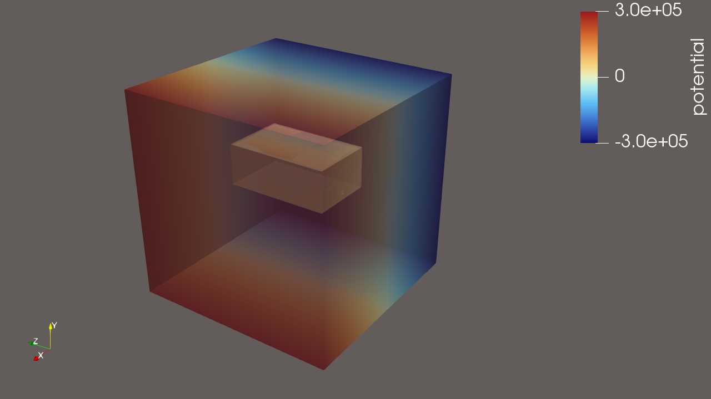
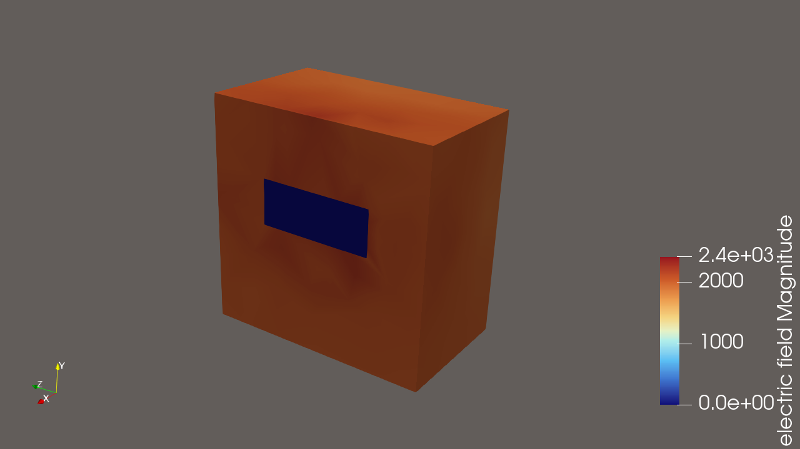

# Faraday cage simulation

## Background

### Motivation

This project was done in the winter of 2026 at the request of a friend currently working at a startup. The startup was planning on flying drones close to powerlines and needed to know how the electric and magnetic fields would affect the circuitry. The plan was to build a faraday cage around the circuitry, and he wanted a simulation to test out the viability of the faraday cage.

He sent me a CAD model of the faraday cage, and I went through the steps of meshing it using gmsh and integrating it with ElmerGrid and ElmerSolver to produce a simulation

### End Result

By the time I was halfway through, I had made good progress, but was informed that the general direction the startup was taking was going to be different and that simulations like the one I was doing wouldn't be needed. The technical difficulties of flying these drones near intense electric and magnetic fields was too high, and the friend who I was in correspondance with told me that the calculations he did led him to the conclusion that it was basically impossible to get feasibly working. 

As a result, I did not end up simulating anything too complicated, at least for now, and focused on simple a simple electrostatics simulation. The simulation is succesful and shows the near lack of any electric field inside the cage.

### Images

#### 1. 

This shows the boundary surrounding the main Faraday cage, with a voltage gradient across it. The Faraday cage simply sits inside the boundary 

#### 2. 

Here it is easy to see that the electric field outside the Faraday cage is non zero, while the electric field inside is either zero or significantly small. The apparent nonuniformity of the electric field due to non-uniform coloring is assumed to be due to the Faraday cage itself. This simulation was ran without the Faraday cage at all and the color map for the electric field in these cases was uniform in color. These results may be posted at a later date to provide clarity into this

## How to navigate this project

1. The notes.md contains all notes I wrote for myself in the process of learning the project workflow and all of the tools required, such as Elmer, gmsh, and more. This notes file is primarily for myself and is most likely not useful for someone else looking at the file, except that it documents my learning process in both Linux and the other tools as mentioned above. Parts of these notes are currently outdated due to having switched from using WSL to a full linux environment, among other things. They will be updated in the future. 
2. The results folder contains a .vtu file which can be opened up in ParaView, as well as some.pvsm files which can be opened in ParaView to quickly view the end result visuals that are shown above
3. There is an output.log file, which is used primarily for troubleshooting
4. The sif directory contains the case.sif file ElmerSolver will use to run the simulation. It also contains a sif-notes.md file, which is mostly for myself to document any important information I needed while learning how to write using the .sif language. It also contains a template.sif file which is copied from template projects I created throughout the learning process.
5. I wrote some python scripts to try and automate storing the simulation results in a .db file using SQL. Much of this is unfinished and quite messy, and I will be updating the project further to clean up these files. Currently, all of this scripting is stored in its seperate directory called 'script-stuff'

### Workflow

The process of generating the simulation is complex and depends heavily on tooling. There are countless choices that can be made at every step. 

1. First a CAD model must be imported. For the purposes here this will be in the form of a `.step` file
2. Second, this `.step `file must be meshed using `gmsh`, and turned into a `.msh` file. This can be done either using the `gmsh` native `.geo` file type, or using the `gmsh` python API. After using the `.geo` file for the intitial runs, it eventually became hard to justify using, and I switched to a python script. This script can be found in the `python-scripts` directory and is titled `gmsh-script.py`. The script defines the physical groups for `ElmerSolver` to interpret and creates a box of air around the Faraday Cage. All of these files live in the `meshing` directory. 
3. After creating the `.msh` file, it must be converted into files that `ElmerSolver` can read. This is done using `ElmerGrid`, more specifically, the command `ElmerGrid 14 2 model.msh`. This will create a `mesh` directory which stores the relevant files for `ElmerSolver` to interpret.
4. `ElmerSolver` can now be run from within the project directory. It will read the `ELMERSOLVER_STARTINFO` file to know where to access the `case.sif` file. the `case.sif` file contains the filetype to be output, in this case a `.vtu` file. 
5. The `.vtu` file can be opened up in ParaView. Once in ParaView, the `.pvsm` files can be used to view the images shown above

